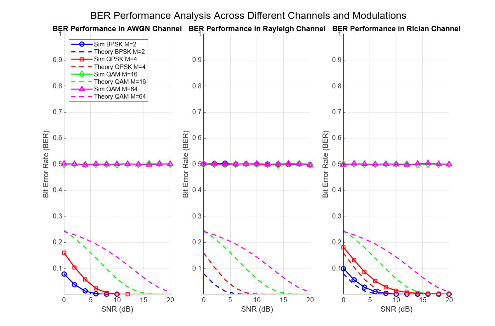
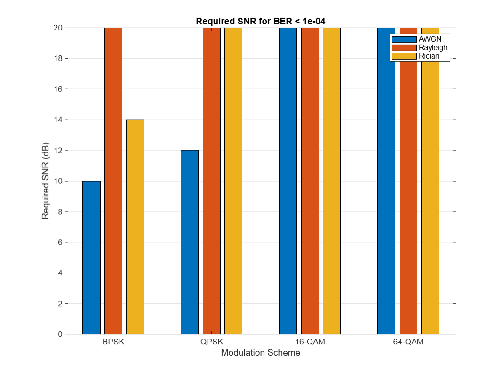
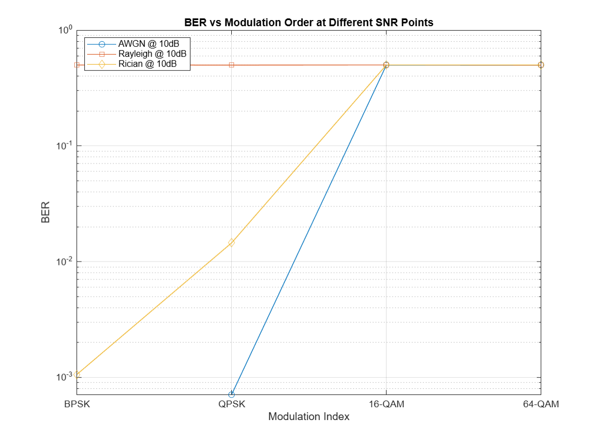

# BER Analyzer

A MATLAB class implementation for analyzing Bit Error Rate (BER) performance of different digital modulation schemes under various channel conditions.

## Features

- Supports multiple modulation schemes:
  - BPSK (Binary Phase Shift Keying)
  - QPSK (Quadrature Phase Shift Keying)
  - QAM (Quadrature Amplitude Modulation) with configurable order
- Channel models:
  - AWGN (Additive White Gaussian Noise)
  - Rayleigh fading
  - Rician fading (with configurable K-factor)
- Comprehensive analysis tools:
  - BER simulation
  - Theoretical BER calculation
  - Performance visualization
- Custom implementations of:
  - Q-function
  - QAM constellation mapping/demapping
  - Binary-decimal conversion utilities

## Results

### BER Performance Analysis Across Different Channels and Modulations
 

### Required SNR for BER < 1e-4
 

### BER vs Modulation Order at Different SNR Points
 


## Usage

### Basic Example

```matlab
% Create a BER Analyzer instance
snrRange = -5:2:20;  % SNR range in dB
berAnalyzer = BERAnalyzer('QPSK', 4, snrRange, 1e6, 'AWGN');

% Run analysis
[ber, theoretical] = berAnalyzer.analyzeBER();

% Plot results
berAnalyzer.plotResults(ber, theoretical);
```

### Creating an Analyzer with Different Parameters

```matlab
% For 16-QAM in Rayleigh channel
berAnalyzer = BERAnalyzer('QAM', 16, -5:2:25, 1e6, 'Rayleigh');

% For BPSK in Rician channel
berAnalyzer = BERAnalyzer('BPSK', 2, 0:2:20, 1e6, 'Rician');
```

## Class Parameters

| Parameter    | Description                           | Options/Type              |
|-------------|---------------------------------------|---------------------------|
| modType     | Modulation scheme                     | 'BPSK', 'QPSK', 'QAM'    |
| M           | Modulation order                      | 2, 4, 16, 64, etc.       |
| SNRdB       | Signal-to-Noise Ratio range          | Array of dB values       |
| numBits     | Number of bits for simulation         | Integer                  |
| channelType | Channel model                         | 'AWGN', 'Rayleigh', 'Rician' |

## Methods

- `generateSignal()`: Generates modulated symbols from random bits
- `applyChannel()`: Applies channel effects and noise
- `demodulate()`: Performs symbol demodulation
- `analyzeBER()`: Calculates both simulated and theoretical BER
- `plotResults()`: Visualizes BER performance curves

## Requirements

- MATLAB R2018b or newer
- Communications Toolbox (recommended but not required)

## Installation

1. Clone or download the repository
2. Add the class file to your MATLAB path
3. Create an instance of the BERAnalyzer class with desired parameters

## Note on Performance

- For accurate results, it's recommended to use `numBits ≥ 1e6`
- Simulation time increases with higher modulation orders and longer SNR ranges
- For QAM, M should be a perfect square (4, 16, 64, etc.)

## Contributing

Feel free to submit issues, fork the repository, and create pull requests for any improvements.

## License

This project is licensed under the MIT License - see the LICENSE file for details.
